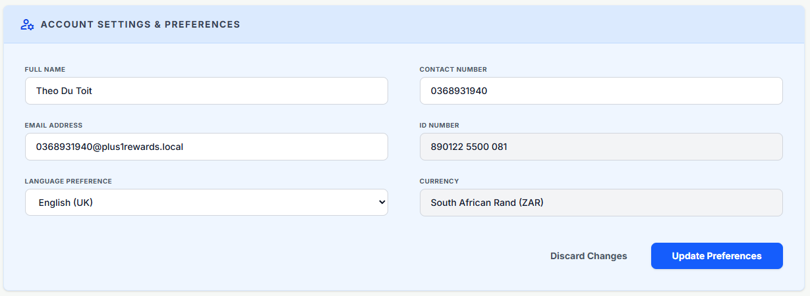

# Test User Credentials - 90% Policy Progress

## Test Member Account
- **Name:** Test Member 90%
- **Phone:** 0821234567
- **Email:** testmember90@test.com
- **QR Code:** TEST90MEMBER
- **PIN:** 123456
- **Status:** Active

### Cover Plan Status
- **Plan:** Day to Day Single
- **Target Amount:** R385.00
- **Funded Amount:** R385.00
- **Progress:** 100.00%
- **Status:** ACTIVE ✓
- **Overflow Balance:** R200.00
- **Active From:** April 1, 2026
- **Active To:** May 1, 2026 (30 days)

### Transaction History
1. **Transaction 1** (2 days ago)
   - Partner: Test Partner Store
   - Purchase: R962.50
   - Cashback: R173.25 (20%)
   - Progress after: 45%

2. **Transaction 2** (1 day ago)
   - Partner: Test Partner Store
   - Purchase: R962.50
   - Cashback: R173.25 (20%)
   - Progress after: 90%

3. **Transaction 3** (Today)
   - Partner: Test Partner Store
   - Purchase: R1,325.00
   - Cashback: R238.50 (20%)
   - Progress after: 100% + R200 overflow
   - **Policy Activated!**

**Total Purchases:** R3,250.00
**Total Cashback Earned:** R585.00
**Allocated to Policy:** R385.00
**Available in Overflow:** R200.00

---

## Test Partner Account
- **Shop Name:** Test Partner Store
- **Owner:** Test Partner Owner
- **Phone:** 0827654321
- **Email:** testpartner@test.com
- **PIN:** 
- **Cashback Rate:** 20%
- **Category:** Grocery
- **Status:** Active

### Cashback Split (20% total)
- System: 1% (R9.625 per transaction)
- Agent: 1% (R9.625 per transaction)
- Member: 18% (R173.25 per transaction)

---

## Login Instructions

### Member Login
1. Go to `/member/login`
2. Enter phone: `0821234567`
3. Enter PIN: `123456`
4. View dashboard at `/member/dashboard`

### Partner Login
1. Go to `/partner/login`
2. Enter phone: `0827654321`
3. Enter PIN: `654321`

---

## Testing Notes

- The member profile has been completed with email, SA ID, and suburb
- The policy is now ACTIVE with 100% funding (R385.00)
- The member has R200.00 in overflow balance available for:
  - Upgrading to a higher plan
  - Adding dependants
  - Sponsoring someone
  - Future policy renewals
- Policy is active from April 1, 2026 to May 1, 2026 (30 days)
- Both accounts are connected via `member_partner_connections` table
- All 3 transactions are marked as "completed"
- Transaction dates span 3 days (2 days ago, 1 day ago, today)

---

# Additional Test Members

## Test Member 2: Minimal Profile (90% Progress)
- **Name:** Test Member Minimal
- **Phone:** 0823456789
- **PIN:** 111111
- **Email:** minimal@plus1rewards.local (placeholder)
- **SA ID:** Not provided
- **Suburb:** Not provided
- **Status:** Active

### Cover Plan Status
- **Plan:** Day to Day Single
- **Target Amount:** R385.00
- **Funded Amount:** R346.50
- **Progress:** 90.00%
- **Status:** In Progress
- **Overflow Balance:** R0.00

### Profile Completeness
- ❌ Email (using placeholder)
- ❌ SA ID Number
- ❌ Suburb

**Note:** This member will trigger the "Profile Incomplete" modal when reaching 90%+ progress.

---

## Test Member 3: Complete Profile (90% Progress)
- **Name:** Test Member Complete
- **Phone:** 0824567890
- **PIN:** 222222
- **Email:** complete@test.com
- **SA ID:** 8505125800082
- **Suburb:** Claremont
- **City:** Cape Town
- **Postal Code:** 7708
- **Status:** Active

### Cover Plan Status
- **Plan:** Day to Day Single
- **Target Amount:** R385.00
- **Funded Amount:** R346.50
- **Progress:** 90.00%
- **Status:** In Progress
- **Overflow Balance:** R0.00

### Profile Completeness
- ✓ Valid Email
- ✓ SA ID Number
- ✓ Suburb

**Note:** This member has a complete profile and can activate their policy when reaching 100%.

---

## Quick Login Reference

| Member | Phone | PIN | Profile Status | Progress |
|--------|-------|-----|----------------|----------|
| Test Member 90% | 0821234567 | 123456 | Complete | 100% (Active) |
| Test Member Minimal | 0823456789 | 111111 | Incomplete | 90% |
| Test Member Complete | 0824567890 | 222222 | Complete | 90% |

**Partner:** 0827654321 / PIN: 654321
